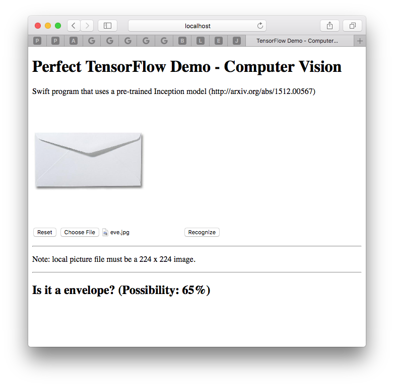
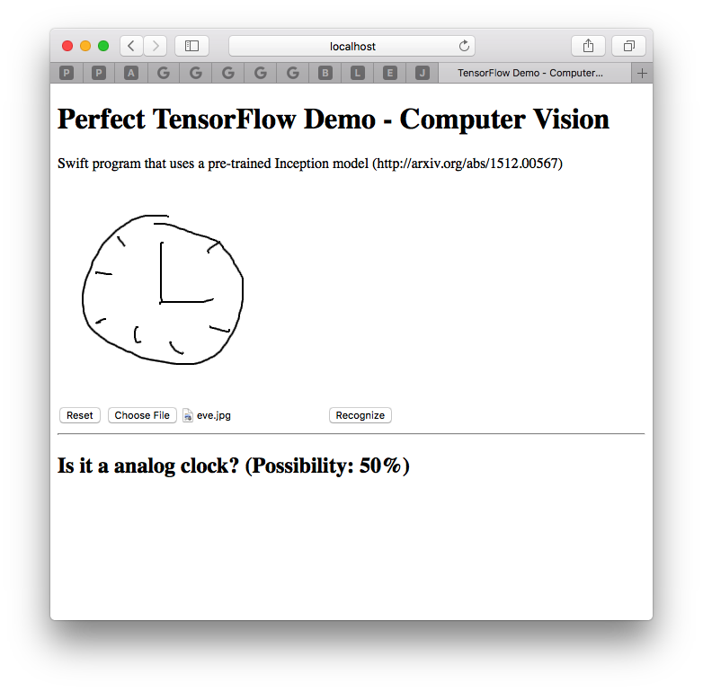

# Perfect TensorFlow Demo of Computer Vision [简体中文](README.zh_CN.md)

<p align="center">
    <a href="http://perfect.org/get-involved.html" target="_blank">
        
    </a>
</p>

<p align="center">
    <a href="https://github.com/PerfectlySoft/Perfect" target="_blank">
        
    </a>  
    <a href="http://stackoverflow.com/questions/tagged/perfect" target="_blank">
        
    </a>  
    <a href="https://twitter.com/perfectlysoft" target="_blank">
        
    </a>  
    <a href="http://perfect.ly" target="_blank">
        
    </a>
</p>

<p align="center">
    <a href="https://developer.apple.com/swift/" target="_blank">
        
    </a>
    <a href="https://developer.apple.com/swift/" target="_blank">
        
    </a>
    <a href="http://perfect.org/licensing.html" target="_blank">
        
    </a>
    <a href="http://twitter.com/PerfectlySoft" target="_blank">
        
    </a>
    <a href="http://perfect.ly" target="_blank">
        
    </a>
</p>

Perfect TensorFlow Server Example of Computer Vision

This repository demonstrates how to apply Perfect TensorFlow, a Swift library of Machine Learning, into a Web Service. If you are not familiar with Perfect, please try [Perfect Template Server](https://github.com/PerfectlySoft/PerfectTemplate.git) first.

## Compatibility with Swift

The master branch of this project currently compiles with **Swift 5.2** toolchain on both macOS.

## Building & Running

The following will clone and build a sample http project and launch the server on port 8080.

```
git clone https://github.com/PerfectExamples/Perfect-TensorFlow-Demo-Vision.git
cd Perfect-TensorFlow-Demo-Vision
./install.sh && swift run
```

You should see the following output:

```
[INFO] Starting HTTP server localhost on 0.0.0.0:8080
```

This means the servers are running and waiting for connections. Access [http://localhost:8080/](http://127.0.0.1:8080/) to see a page that allow user to try image content recognition by either uploading a picture from local computer or drawing a scribble with mouse brush:

</img>
</img>

To stop the server, press Control-C.

## Introduction

This demo is a Swift program that uses a pre-trained Inception model (http://arxiv.org/abs/1512.00567).

It can load the prebuilt model into a Perfect TensorFlow Session object, like this:

``` swift
let g = try TF.Graph()
let def = try TF.GraphDef(serializedData: model)
try g.import(definition: def)
```

Accompanied by this model, a known object name list also would be loaded into memory if success.

``` swift
try fTag.open(.read)
let lines = try fTag.readString()
tags = lines.utf8.split(separator: 10).map { String(describing: $0) }
// the tags should be looks like this if success:
// tags = ["dummy", "kit fox", "English setter", "Siberian husky" ...]
```

Once received a picture from client, it will decode the picture (in jpeg format) and normalize it into a specific form:

``` swift
  public func constructAndExecuteGraphToNormalizeImage(imageBytes: Data) throws -> TF.Tensor {
    let H:Int32 = 224
    let W:Int32 = 224
    let mean:Float = 117
    let scale:Float = 1
    let input = try g.constant(name: "input2", value: imageBytes)
    let batch = try g.constant( name: "make_batch", value: Int32(0))
    let scale_v = try g.constant(name: "scale", value: scale)
    let mean_v = try g.constant(name: "mean", value: mean)
    let size = try g.constantArray(name: "size", value: [H,W])
    let jpeg = try g.decodeJpeg(content: input, channels: 3)
    let cast = try g.cast(value: jpeg, dtype: TF.DataType.dtFloat)
    let images = try g.expandDims(input: cast, dim: batch)
    let resizes = try g.resizeBilinear(images: images, size: size)
    let subbed = try g.sub(x: resizes, y: mean_v)
    let output = try g.div(x: subbed, y: scale_v)
    let s = try g.runner().fetch(TF.Operation(output)).run()
    guard s.count > 0 else { throw TF.Panic.INVALID }
    return s[0]
  }//end normalize
```

Then you can run a TensorFlow session from this picture input:

``` swift
let result = try g.runner().feed("input", tensor: image).fetch("output").run()
```

The result is actually a possibility array which matches the known object name list, i.e., each object in this name list will have a possibility prediction in the corresponding array slot. So checking the max possibility throughout the array may get the most possible object that the input image could be:

``` swift
public func match(image: Data) throws -> (Int, Int) {
    let normalized = try constructAndExecuteGraphToNormalizeImage(imageBytes: image)
    let possibilities = try executeInceptionGraph(image: normalized)
    guard let m = possibilities.max(), let i = possibilities.index(of: m) else {
      throw TF.Panic.INVALID
    }//end guard
    return (i, Int(m * 100))
  }
```

The final step is translating the result object index into the tag name of the object and sending it back to the client:

``` swift
let tag = tags[result.0]
      let p = result.1
      response.setHeader(.contentType, value: "text/json")
        .appendBody(string: "{\"value\": \"Is it a \(tag)? (Possibility: \(p)%)\"}")
        .completed()
```

## Issues

We are transitioning to using JIRA for all bugs and support related issues, therefore the GitHub issues has been disabled.

If you find a mistake, bug, or any other helpful suggestion you'd like to make on the docs please head over to [http://jira.perfect.org:8080/servicedesk/customer/portal/1](http://jira.perfect.org:8080/servicedesk/customer/portal/1) and raise it.

A comprehensive list of open issues can be found at [http://jira.perfect.org:8080/projects/ISS/issues](http://jira.perfect.org:8080/projects/ISS/issues)


## Further Information
For more information on the Perfect project, please visit [perfect.org](http://perfect.org).

