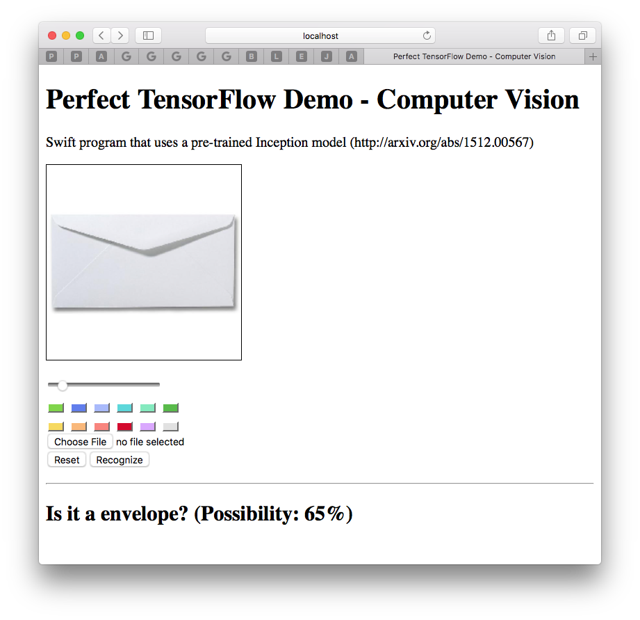
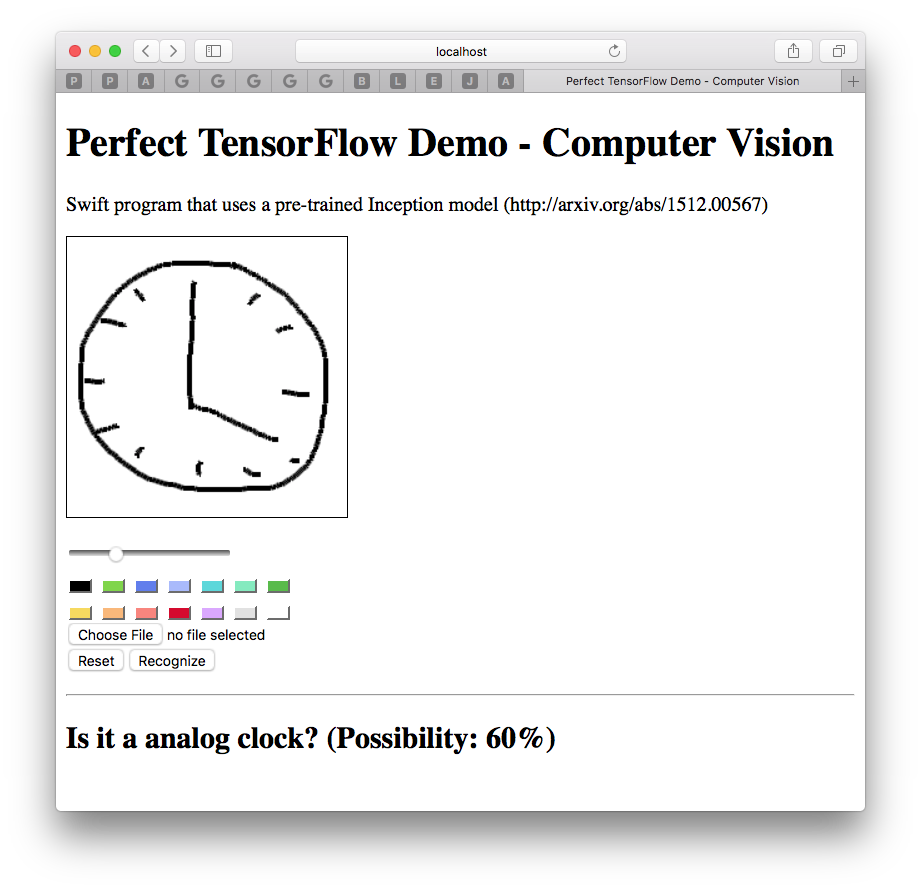

# Perfect TensorFlow 机器视觉演示程序 [English](https://github.com/PerfectlySoft/PerfectTemplate)

<p align="center">
    <a href="http://perfect.org/get-involved.html" target="_blank">
        
    </a>
</p>

<p align="center">
    <a href="https://github.com/PerfectlySoft/Perfect" target="_blank">
        
    </a>  
    <a href="http://stackoverflow.com/questions/tagged/perfect" target="_blank">
        
    </a>  
    <a href="https://twitter.com/perfectlysoft" target="_blank">
        
    </a>  
    <a href="http://perfect.ly" target="_blank">
        
    </a>
</p>

<p align="center">
    <a href="https://developer.apple.com/swift/" target="_blank">
        
    </a>
    <a href="https://developer.apple.com/swift/" target="_blank">
        
    </a>
    <a href="http://perfect.org/licensing.html" target="_blank">
        
    </a>
    <a href="http://twitter.com/PerfectlySoft" target="_blank">
        
    </a>
    <a href="http://perfect.ly" target="_blank">
        
    </a>
</p>


Perfect TensorFlow 人工智能与神经网络演示程序——机器视觉

本源代码展示了如何在服务器端使用Perfect TensorFlow开发Swift 应用，并实现人工智能图像识别的网络服务。如果您还不熟悉Perfect软件框架，请首先尝试 [Perfect 模板服务器](https://github.com/PerfectlySoft/PerfectTemplate.git) 。

## Swift 兼容性说明

本项目目前使用 **Swift 5.2** 工具链编译，可以在macOS上使用。

## 编译运行

运行以下命令可以运行本示例程序并在8080端口创建服务器：

```
git clone https://github.com/PerfectExamples/Perfect-TensorFlow-Demo-Vision.git
cd Perfect-TensorFlow-Demo-Vision
./install.sh && swift run
```

应该能够看到以下输出：

```
[INFO] Starting HTTP server localhost on 0.0.0.0:8080
```

意味着服务器已经准备好，请访问 [http://localhost:8080/](http://127.0.0.1:8080/) 查看演示主页，您可以如下图所示上载一个本地图片考验计算机是否能够识别，或者甚至可以用鼠标手绘一个草图来测试计算机视觉识别能力：

</img>
</img>


组合键control-c可以停止服务器运行。


## 简介

本样例代码使用了一个预先训练好的机器视觉模型： (http://arxiv.org/abs/1512.00567).

您可以将人工神经网络模型文件加载到一个Perfect TensorFlow Session对象，像这样：

``` swift
let g = try TF.Graph()
let def = try TF.GraphDef(serializedData: model)
try g.import(definition: def)
```

连同模型一起下载的还有一个已知物体的名单（英文）文件：

``` swift
try fTag.open(.read)
let lines = try fTag.readString()
tags = lines.utf8.split(separator: 10).map { String(describing: $0) }
// 字符串数组变量应该看起来像这样：
// tags = ["dummy", "kit fox", "English setter", "Siberian husky" ...]
```

一旦从客户端收到图片后，服务器会将图片内容正规化：

``` swift
  public func constructAndExecuteGraphToNormalizeImage(imageBytes: Data) throws -> TF.Tensor {
    let H:Int32 = 224
    let W:Int32 = 224
    let mean:Float = 117
    let scale:Float = 1
    let input = try g.constant(name: "input2", value: imageBytes)
    let batch = try g.constant( name: "make_batch", value: Int32(0))
    let scale_v = try g.constant(name: "scale", value: scale)
    let mean_v = try g.constant(name: "mean", value: mean)
    let size = try g.constantArray(name: "size", value: [H,W])
    let jpeg = try g.decodeJpeg(content: input, channels: 3)
    let cast = try g.cast(value: jpeg, dtype: TF.DataType.dtFloat)
    let images = try g.expandDims(input: cast, dim: batch)
    let resizes = try g.resizeBilinear(images: images, size: size)
    let subbed = try g.sub(x: resizes, y: mean_v)
    let output = try g.div(x: subbed, y: scale_v)
    let s = try g.runner().fetch(TF.Operation(output)).run()
    guard s.count > 0 else { throw TF.Panic.INVALID }
    return s[0]
  }//end normalize
```

然后就可以跑一下TensorFlow的会话输出：

``` swift
let result = try g.runner().feed("input", tensor: image).fetch("output").run()
```

结果是一个概率数组，其长度与名单吻合，用于预测名单中每一个对象可能的概率。因此只要找出数组中最大概率就可以获得图像被“识别”的结果：

``` swift
public func match(image: Data) throws -> (Int, Int) {
    let normalized = try constructAndExecuteGraphToNormalizeImage(imageBytes: image)
    let possibilities = try executeInceptionGraph(image: normalized)
    guard let m = possibilities.max(), let i = possibilities.index(of: m) else {
      throw TF.Panic.INVALID
    }//end guard
    return (i, Int(m * 100))
  }
```

最后一步就是把概率索引转换为对象名称，然后发给客户端：

``` swift
let tag = tags[result.0]
      let p = result.1
      response.setHeader(.contentType, value: "text/json")
        .appendBody(string: "{\"value\": \"Is it a \(tag)? (Possibility: \(p)%)\"}")
        .completed()
```


## 问题报告

目前我们已经把所有错误报告合并转移到了JIRA上，因此github原有的错误汇报功能不能用于本项目。

您的任何宝贵建意见或建议，或者发现我们的程序有问题，欢迎您在这里告诉我们。[http://jira.perfect.org:8080/servicedesk/customer/portal/1](http://jira.perfect.org:8080/servicedesk/customer/portal/1)。

目前问题清单请参考以下链接： [http://jira.perfect.org:8080/projects/ISS/issues](http://jira.perfect.org:8080/projects/ISS/issues)


## 更多内容
关于Perfect更多内容，请参考[perfect.org](http://perfect.org)官网。
